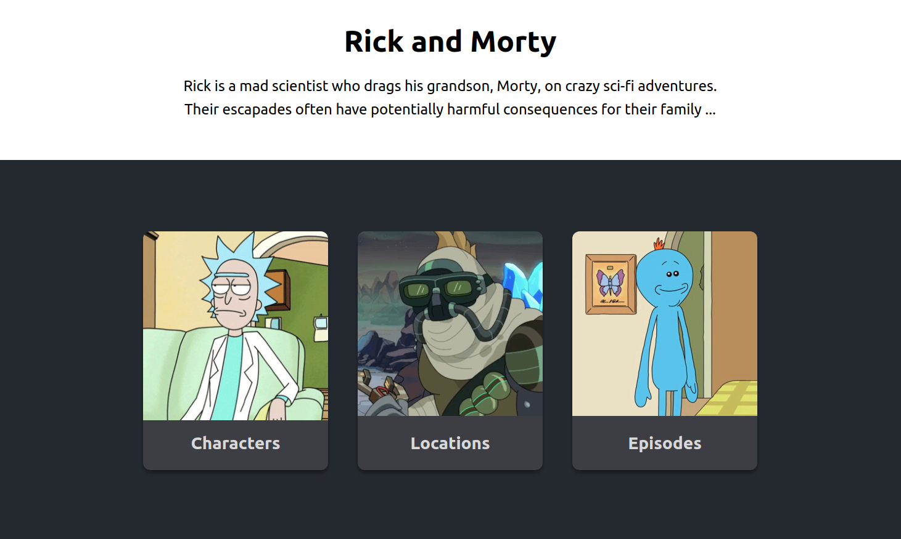
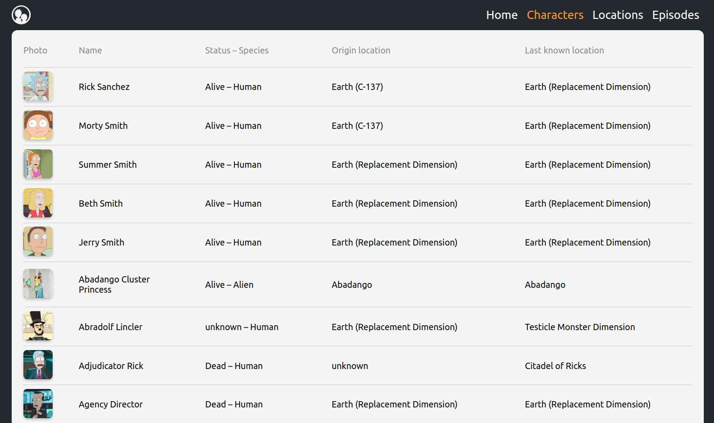
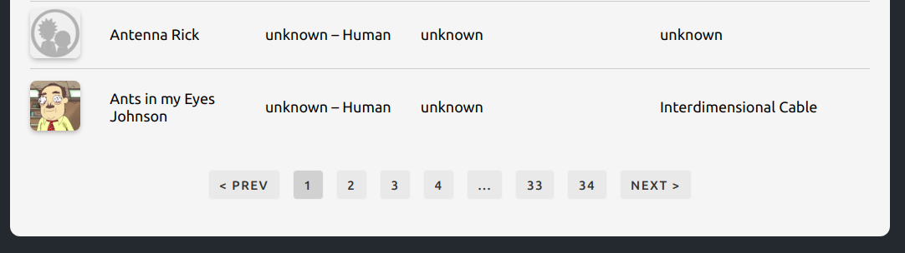
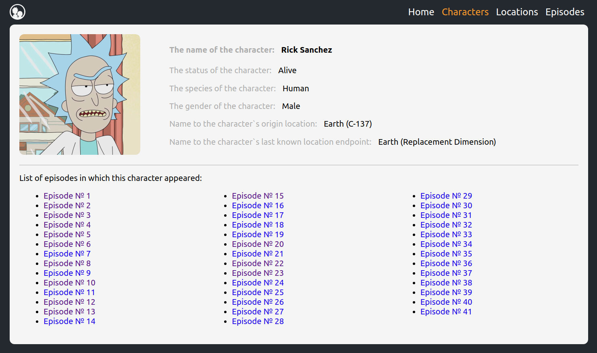

# Rick and Morty



## [Live demo](https://api-rick-and-morty.netlify.app/)

## Description

The app is based on the Rick and Morty API. The following libraries were used: React, Redux, Redux-Saga and others.
The application has several main pages:

- Home

  

- Thematic pages: characters, locations and episodes, which display the corresponding lists.

  

- Convenient navigation is implemented on the pages with lists.

  

- By clicking on any of the items in the list, you will go to the page where detailed information about each is located.

  

## Project setup

```
npm install
npm start
```
